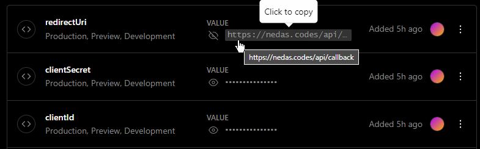

# Personal Portfolio (https://nedas.codes/)
> Over complicated portfolio that is simple to **edit** and **deploy** using **vercel**

## Features 📃
- Fully customisable/Editable config files to meet your requirements
- Spotify implementation showing the current song you are listening to
- Most importantly written in Vite using Vue 3 with Vercel serverless functions

## Sections 📚
- About
- Skills
- Projects
- Socials
- Contact Info

## Technologies Used 💻
- **Vue**- The JavaScript framework for building user interfaces
- **SASS** - The CSS preprocessor
- **Three.js** - The JavaScript 3D library
- **Vercel** - The serverless platform for deploying Vite apps
## Installation & Deployment 📦
**Required command line tools:**
> **npm** - The package manager for Node.js\
> **yarn** - The package manager for Yarn\
> **vercel** - The serverless platform for deploying Vite apps\
### 1) Installation
    $ git clone https://github.com/LegendNed/portfolio
    $ cd portfolio
    $ yarn install
    $ yarn build

    $ vercel
    ? Set up and deploy “~\Desktop\portfolio”? [Y/n] y
    ? Which scope do you want to deploy to? <YOUR NAME>
    ? Link to existing project? [y/N] n
    ? What’s your project’s name? portfolio
    ? In which directory is your code located? ./
    ? Want to modify these settings? [y/N] n

### 2) Setup
1. Modify the configuration files found in `src/assets/windows/` and ensure to change the photo found in `src/images/me.png`.
    1. (Optional) Change the qoutes as they they were randomly generated, found in `src/assets/quotes.json`
2. Create an application on [Spotify Developer Portal](https://developer.spotify.com/dashboard/applications)\
Choose **edit settings** then in website field, enter your webiste URL (e.g. https://nedas.codes/) then in the **Redirect URIs** enter your website URL ending with `/api/callback` (e.g. https://nedas.codes/api/callback)
3. Using the URL provided from **vercel** command or **vercel dashboard** access the portfolio application then go to **Settings - Envrioment Variables** and add the following: 
(If you proceed to work on this project, edit the `.env.example` file and run `vercel dev` to open a development enviroment)
4. Set up temporary data store for spotify data/tokens using **[Upstash](https://vercel.com/integrations/upstash)** by clikcing Add integration and choosing the project it should belong to.
5. Run `vercel dev` to open a development enviroment
6. **VISIT `<YOUR DOMAIN\>/api/listening` to authenticate your spotify account for the first build!**\
**(This only has to be done once and can never be reauthenticated unless redis database is cleared)**